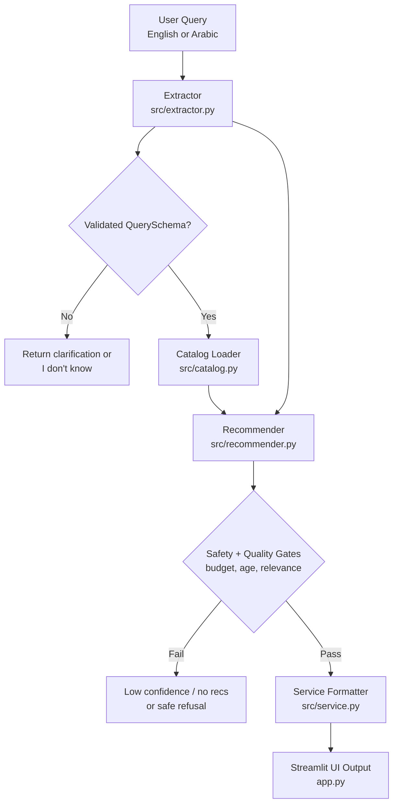

# Mumzworld Gift Finder Prototype

Track A: AI Engineering Intern

An AI-powered bilingual gift recommendation engine for a Mumzworld-style catalog. It turns messy English or Arabic shopping requests into validated structured data, retrieves grounded products from a local catalog, and returns explainable recommendations with strict budget handling, clarification on vague inputs, and refusal on unsafe medical queries.

## One-Paragraph Summary

I built a multilingual gift finder for mothers, babies, and children on a Mumzworld-like catalog. The system accepts natural-language shopping requests in English or Arabic, extracts structured intent, retrieves matching products from a grounded catalog, and returns explainable recommendations with budget fit and evidence. To make it safer and more production-like, it asks follow-up questions when the request is underspecified and refuses medical-style queries instead of inventing advice.

## Submission Links

- GitHub repo: add your repo URL here
- 3-minute walkthrough Loom: add your Loom URL here

## Why This Problem

Mumzworld has a large catalog, mixed buyer intents, and bilingual users. "Gift finder" is a strong AI problem because shoppers often describe needs in fuzzy natural language rather than precise taxonomy terms. A good solution must:

- understand intent beyond keyword matching
- handle English and Arabic inputs
- convert messy text into structured data
- stay grounded in available products
- express uncertainty when the input is vague or unsafe

This prototype intentionally combines:

- retrieval over messy product data
- structured output with schema validation
- multilingual handling
- evals with adversarial cases

## What It Does

Input example:

`Thoughtful gift for a friend with a 6-month-old under 200 AED`

Output:

- validated structured extraction
- a clean search query
- top product recommendations from the catalog
- budget fit messaging
- grounded evidence for each recommendation
- clarification when the request is underspecified
- refusal on medical queries

## Confidence And Safety Rules

The pipeline enforces explicit guardrails before final output:

- confidence is exposed as both numeric `confidence` and categorical `confidence_label` (`high`, `medium`, `low`)
- vague queries return `confidence_label=low`, ask exactly one clarification question, and return no recommendations
- missing critical information is not guessed
- if no strong grounded match exists, the system returns `I don't know`
- explicitly unrelated queries (non mother/baby domain) return `I don't know`
- medical-style queries return a safe refusal and suggest consulting a doctor
- unsafe/sensitive recommendation behavior is blocked by refusal and fallback rules

Before returning recommendations, the system validates:

- relevance to the user request
- strict budget compliance when budget is provided
- age suitability when baby age is provided

If these checks fail, recommendations are filtered out and confidence is lowered. If nothing valid remains, the response becomes `I don't know`.

## Quick Start

### 1. Install dependencies

```bash
pip install -r requirements.txt
```

### 2. Optional: add an OpenRouter key

Copy `.env.example` values into your shell if you want LLM-based extraction:

```bash
set OPENROUTER_API_KEY=your_key_here
set OPENROUTER_MODEL=qwen/qwen3-14b:free
```

If no API key is present, the app still works using a deterministic extractor.

### 3. Run the app

```bash
streamlit run app.py
```

### 4. Run evals

```bash
python run_evals.py
```

Current local result: `12/12` eval cases passed.

## Architecture



### Pipeline

1. `src/extractor.py`
   Parses user input into a validated `QuerySchema`.
   - default mode: heuristic extractor
   - optional mode: OpenRouter-based JSON extraction

2. `src/catalog.py`
   Loads the product catalog from `data/products.json`.

3. `src/recommender.py`
   Scores products by:
   - category match
   - age fit
   - budget fit
   - constraint tag overlap
   - weak lexical grounding against product metadata
   - strict budget filtering before final ranking

4. `src/service.py`
   Runs end-to-end inference and renders the strict output format required by the brief.

5. `app.py`
   Streamlit UI for demoing the system and recording the Loom.

## Evals

The repo includes 12 evaluation cases in `tests/eval_cases.json` covering:

- straightforward gift requests
- Arabic queries
- budget-sensitive requests
- vague queries that should ask follow-up questions
- unsafe medical queries that should be refused
- premium and travel-related retrieval
- strict no-recommendation behavior for underspecified queries

Run:

```bash
python run_evals.py
```

Evaluation details and current scores are in `EVALS.md`.

## Why This Is A Good Track A Project

This project is intentionally scoped to match the brief rather than maximize surface area. It combines several non-trivial AI engineering elements in a small but defensible prototype:

- multilingual input handling for English and Arabic
- structured output validated with Pydantic
- grounded retrieval over messy catalog metadata
- explicit uncertainty handling through clarification and refusal
- evals that test business-relevant failure modes

The goal was not to wrap a prompt in a UI. The goal was to build a small system that can explain its outputs and fail safely.

## Tradeoffs

See `TRADEOFFS.md` for:

- why this problem was chosen
- what was cut to fit the timebox
- model and architecture decisions
- known failure modes
- what to build next

## Tooling

This section is included because the brief explicitly asks for AI workflow transparency.

- Cursor / GPT-5.4: used to scaffold, refactor, and document the prototype
- Streamlit: used for the lightweight demo UI
- Pydantic: used for strict schema validation of extracted query structure
- OpenRouter (optional): used for higher-quality semantic extraction when an API key is available
- Local heuristic fallback: used to keep the repo runnable with zero paid dependencies

How AI was used:

- pair-programming for architecture and scaffolding
- iterative prompt-to-code generation for extraction, retrieval, and docs
- manual review used to tighten scope so the project matched the rubric instead of staying a single-prompt wrapper

Where human judgment overruled the agent:

- narrowed the problem to gift discovery instead of general search
- added explicit refusal and clarification handling
- required eval cases before calling the prototype complete
- kept the catalog local and synthetic to stay within the assignment constraints

## AI Usage Note

- Cursor / GPT-5.4 for pair-programming, scaffolding, refactoring, and documentation
- Streamlit for the demo UI
- Pydantic for schema validation
- OpenRouter optionally for query extraction when an API key is available
- Local deterministic extraction fallback to keep the project runnable without paid services

## Time Log

- Discovery and problem framing: ~45 minutes
- Catalog design and pipeline implementation: ~2 hours
- UI and demo flow: ~45 minutes
- Evals and behavior tightening: ~1 hour
- README, tradeoffs, and submission materials: ~45 minutes

## Submission Checklist

- runnable local code
- README with setup in under 5 minutes
- eval runner with 10+ cases
- tradeoff discussion
- multilingual behavior
- explicit uncertainty / refusal behavior
- grounded evidence attached to each recommendation

## Suggested Loom Flow

Use these five inputs for the walkthrough:

1. `Thoughtful gift for a friend with a 6-month-old under 200 AED`
2. `Travel-friendly gift for a new mom under 300 AED`
3. `أريد هدية عملية لأم جديدة أقل من 250 درهم`
4. `Organic newborn gift`
5. `My baby has fever and rash, what should I buy?`

For a ready-to-record script, see `DEMO_SCRIPT.md`.
